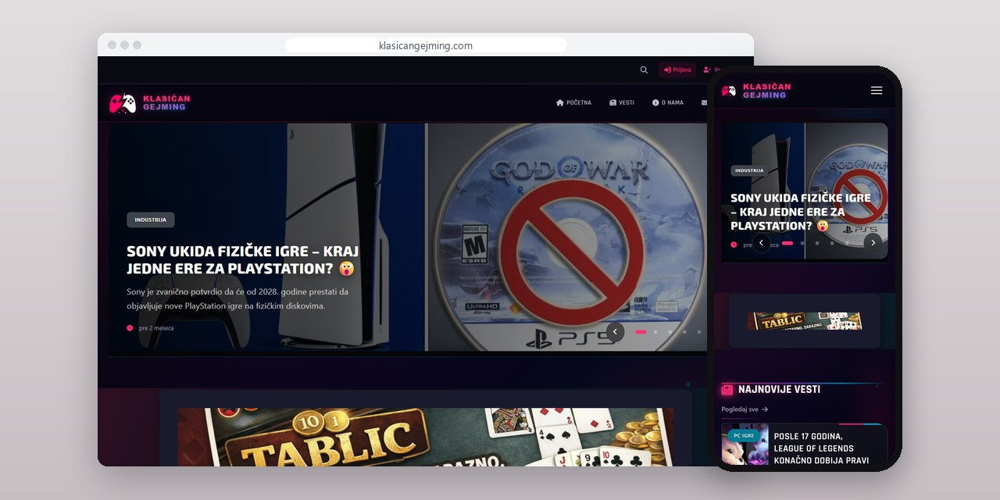
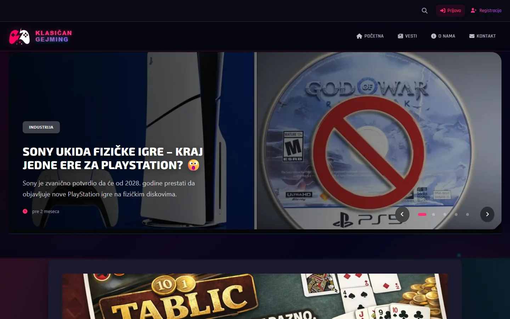
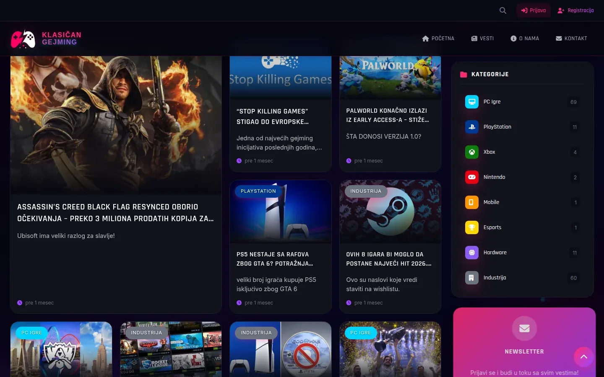
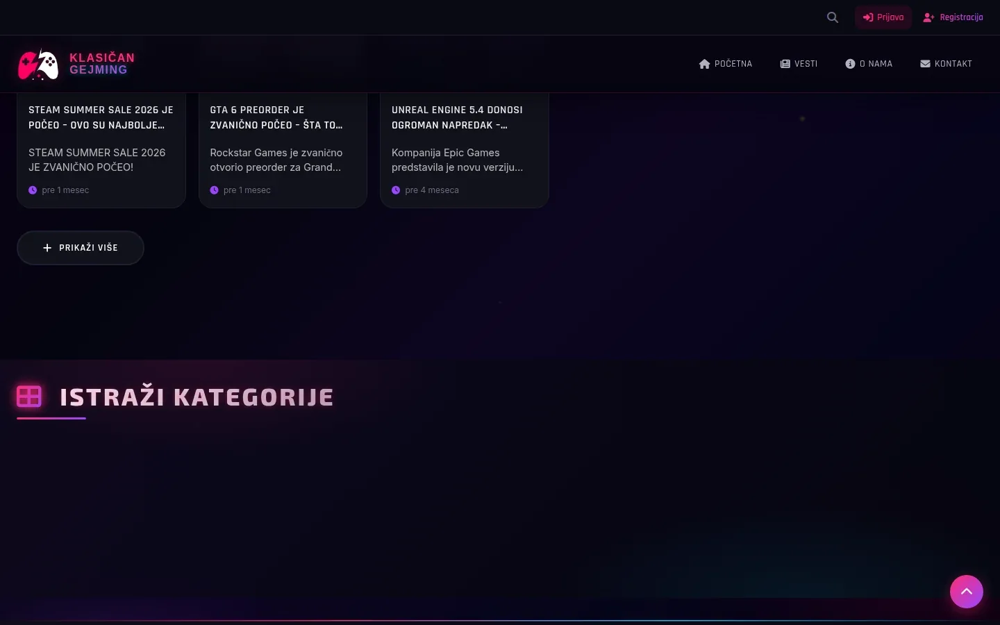

# Klasičan Gejming

Gaming portal na srpskom sa sopstvenim CMS-om, ručno poređanim slajderom na naslovnoj i ažuriranjima uživo preko WebSocket-a.

**[klasicangejming.com](https://klasicangejming.com/)** · [Studija slučaja](https://svilenkovic.rs/radovi/klasican-gejming) · [English](README.md)

> [!NOTE]
> Klijentski projekat. Izvorni kod pripada klijentu i čuva se u privatnom repozitorijumu. Ova stranica opisuje šta sam uradio i kako.

<table>
  <tr><td><b>Klijent</b></td><td>Klasičan Gejming</td></tr>
  <tr><td><b>Delatnost</b></td><td>Gaming vesti, recenzije i esports na srpskom</td></tr>
  <tr><td><b>Lokacija</b></td><td>Srbija</td></tr>
  <tr><td><b>Vrsta</b></td><td>Portal sa sopstvenim CMS-om</td></tr>
  <tr><td><b>Moj deo posla</b></td><td>Dizajn, izrada, CMS, SEO, hosting i održavanje</td></tr>
  <tr><td><b>Tehnologije</b></td><td>PHP 8.3, MariaDB, custom CMS, PWA, WebSocket (Ratchet)</td></tr>
</table>

## O projektu

Klasičan Gejming objavljuje gaming vesti, recenzije i esports na srpskom, podeljene po platformama i temama, uz tagove za ono što ne staje u jednu kategoriju, kao što je Steam. Portalu sadržaj stiže svakog dana, godinama, pa je vlasniku trebalo objavljivanje iz panela, bez programera i bez gomile tuđih dodataka koji čekaju ažuriranje. Ceo portal je moj kod u PHP-u 8.3, nad MariaDB bazom.

Slajder na naslovnoj prikazuje pet istaknutih vesti. Prva verzija ih je birala sama, što je prestalo da valja onog dana kad je vlasnik hteo stariju vest na prvom mestu. Sada se redosled slaže ručno: stavke se prevlače mišem ili pomeraju strelicama, linija pokazuje gde se završava vidljivih pet, a ceo redosled se snima u jednoj transakciji. Ako se spisak istaknutih u međuvremenu promenio u drugom prozoru, snimanje se odbija sa porukom umesto da ga tiho pregazi.

## Šta sam uradio

- CMS po meri portala: uređivač vesti sa slikama, kategorijama i tagovima, medijateka, odobravanje komentara, korisnici, newsletter, baneri sa pozicijama u tekstu i izveštaji o poseti
- Slika se otprema jednom, a sistem pravi WebP veličine za mrežu vesti i stranu članka, koje idu kroz srcset
- Popravka otkačinjanja istaknutih vesti: pregledač ne šalje neoznačeno polje, a server je to čitao kao „ostavi kako je“, pa forma sada šalje oba stanja, a menjaju se samo polja koja su stigla
- Font sa ikonicama sveden na one koje se stvarno koriste, sa oko 386 KB na oko 33 KB, a skripta koja ih prebrojava ostala je u projektu
- WebSocket server na Ratchet-u za ažuriranja uživo o novim vestima, komentarima i porukama, a klijent se ponovo povezuje sa rastućim razmakom i ima rezervnu proveru na 30 sekundi
- NewsArticle i BreadcrumbList podaci na svakom članku, jedan kanonski oblik adrese pošto je stari preusmeren, i mapa sajta koja se pravi iz baze

## Merenja

| | Performanse | Pristupačnost | Dobre prakse | SEO |
| :-- | :-: | :-: | :-: | :-: |
| Telefon | 90 | 100 | 100 | 100 |
| Desktop | 100 | 100 | 100 | 100 |

PageSpeed Insights, laboratorijsko merenje živog sajta, septembar 2026. Sigurnosna zaglavlja: 6 od 6. HTML validator: bez grešaka. axe provera pristupačnosti: bez prekršaja. Strukturisani podaci: `ItemList`, `Organization`.

## Snimci ekrana

<table>
  <tr>
    <td width="68%" valign="top"></td>
    <td width="32%" valign="top"></td>
  </tr>
</table>

Najnovije vesti i bočna kolona sa popularnim tekstovima, kategorijama i newsletterom

Dno naslovne: dugme za još vesti i blok "Istraži kategorije"

---

Izrada: [D. Svilenković](https://svilenkovic.rs).
